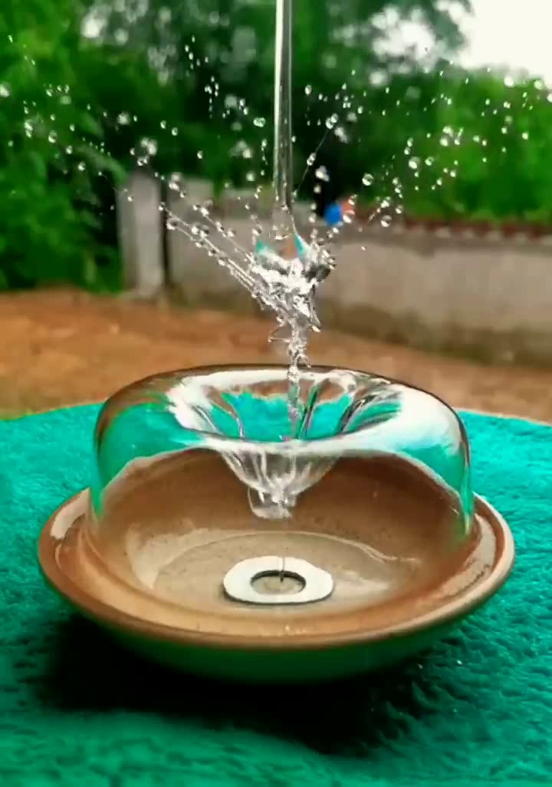
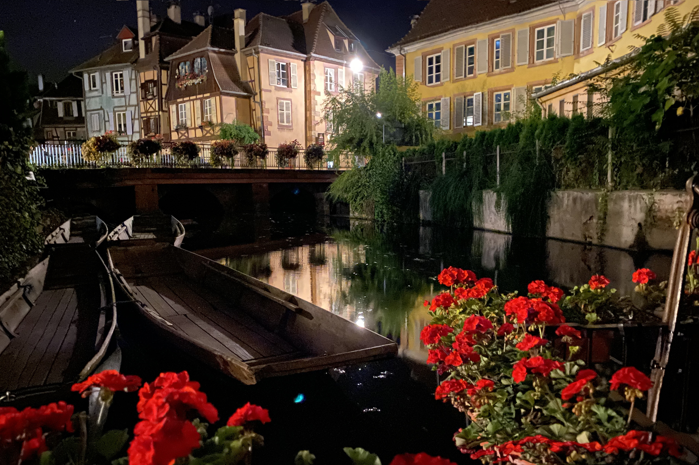
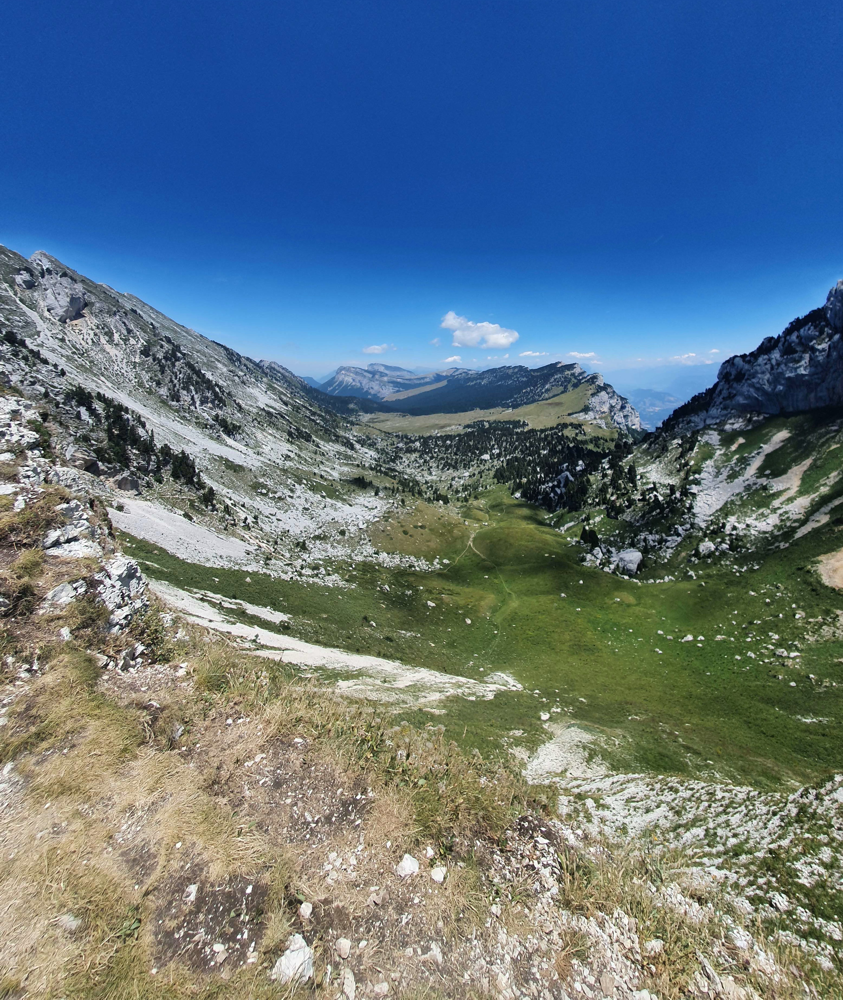
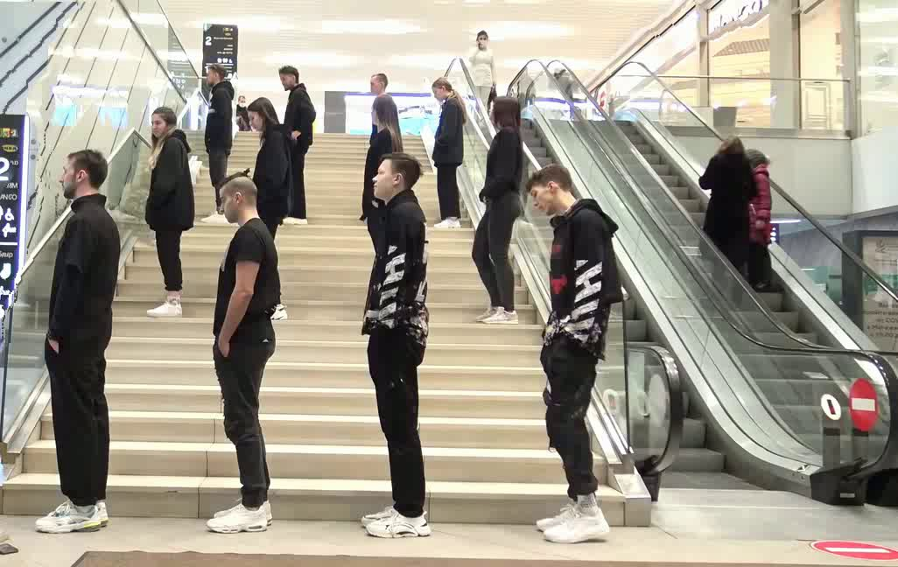

# Seam Carving for Videos

Seam carving is an algorithm for content-aware image resizing. Traditional scaling methods can lead to distorted or 
disproportionate content, but seam carving identifies and removes seams of pixels that have the least energy in the image
while preserving the important content. This technique can be used to reduce the size of an image while retaining its most 
significant features or to add extra pixels to an image to increase its size.

## Table of Contents

- [Basics of Seam Carving](#basics-of-seam-carving)
- [Results](#results)
- [Using the code](#using-the-code)
- [License](#license)


## Basics of Seam Carving

A seam is a vertical or horizontal connected path of pixels. In order to reach the desired format, the algorithm will 
successively remove horizontal and vertical seams. Removing a vertical seam reduces the width by one, and removing a 
horizontal seam reduces the height by one. To find the most appropriate seam to remove, the algorithm computes an energy 
value for each pixel in the image, which can be a gradient magnitude, entropy, visual saliency, or any quantity that 
quantifies the interest of a pixel in the image. Then, the algorithm finds the seam with the least energy, and dynamic 
programming is used to compute this quantity efficiently.

To avoid creating a high-energy zone when removing a seam, the algorithm uses a method called forward energy, which is 
not perfect but improves results in many cases, especially for videos.

We decided to use a "static" algorithm to apply seam carving to videos, which involves creating a unique energy map for 
the entire video and running the classic seam carving algorithm on each frame, removing the same seams throughout the 
video. This approach has several advantages, including its speed and ease of implementation. It also produces superior 
results in comparison to other approaches when the camera is stationary, as fixed objects remain stationary, and it does 
not produce any temporal artifacts. However, this method has some limitations, such as not being able to handle scenes
with camera movements or changes in the scene.


## Results

The [repport](repport.pdf) presents most results. See the folder `results` for many exemples. Here are a few selected 
(and uncommented) ones.










## Using the code

The algorithm is implemented in C++ which offer a good balance between performance and ease of use. We are using the
library openCV. It offers efficient image processing and is easy to use. It is also widely used which could help a lot
when troubleshooting issues.


The project has been intensively tested on MacOS Ventura on an Intel chip and has been tested on a Ubuntu x64 computer. 
We do not know how well it works on other systems. Notice that the project has not been tested on any Windows computer.

First, get a copy of the code. You can clone our repository.
```sh
git clone https://github.com/alexicanesse/FastVideoSeamCarving
```

The project may work with C++11 but has only been tested with `C++17`so we do not offer any guarantee if you decide to 
use an older standard. Same goes for `CMake 3.20`. The libraries `OpenCV` and 
`Boost` are used and must be installed in order to compile. To install those libraries run the following 
command in a terminal
```sh
# For MacOS users
brew install opencv boost

# For Ubuntu users 
sudo apt install libopencv-dev libboost-all-dev
```

Once you're all set, you can finally compile. Run the following commands at the project's root.
```sh
# Create a build directory
mkdir build
cmake -B ./build -S .
cmake --build ./build
```

You can finally run the program. Everything is specified using command line options. Here are the options
```sh
-h [ --help ]             print the help message
-i [ --input ] arg        set the input file
-o [ --output ] arg       set the output file
--h_scale arg             set the horizontal scaling factor
--v_scale arg             set the vertical   scaling factor
-r [ --show_result ]      show the output file
-e [ --show_energy_map ]  show the energy map
```

## License

This project is licensed under the [GNU General Public License v3.0](LICENSE)
Creative Commons License - see the [LICENSE](LICENSE) file for
details

[tl;dr](https://tldrlegal.com/license/gnu-lesser-general-public-license-v3-(lgpl-3)#summary) This license is mainly
applied to libraries. You may copy,
distribute and modify the software provided that modifications are
described and licensed for free under LGPL. Derivatives works
(including modifications or anything statically linked to the library)
can only be redistributed under LGPL, but applications that use the library
don't have to be.